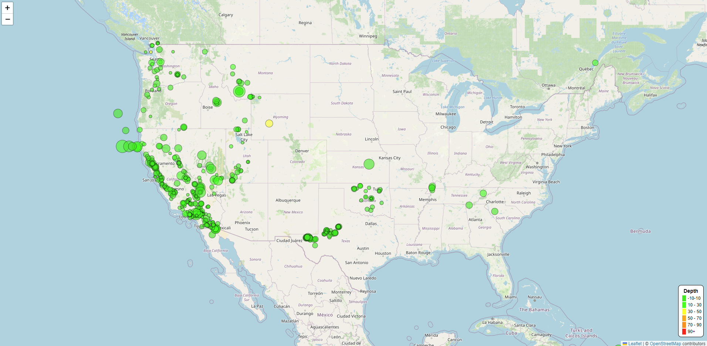

# leaflet-challenge

<h1>An Interactive Earthquake Map</h1>
---------------------------------------------------------------------------------------------
Interactive map to visualize Earthquake areas using HTML, JavaScript, CSS, D3 and Leaflet libraries.

The goal of this assignment was to build an interactive Earthquake visualization with information from the [USGS GeoJSON Feed](https://earthquake.usgs.gov/earthquakes/feed/v1.0/geojson.php) website.

---------------------------------------------------------------------------------------------

## Table of Contents
------------------------------------------------
Leaflet-Part-1 directory:
 - index.html    <-- This is the HTML used to deploy the map in a website
 - static directory:
     -  CSS directory:
        *  style.css    <-- css file that will need to be updated to display the legend on the map
     -   js directory: 
        *  logic.js   <-- file that contains the code to make the map interactive and display the data collected.
     -  Images: contains images from the assignment instruction.
--------------------------------------------------

## Installation
HTML, JS D3, CSS, & Leaftlet

## Instruction
Import and visualize the data by doing the following:

- Using leaflet, create a map that plots all the earthquakes from your dataset based on their longitude and latitude.
  - Your data markers should reflect the magnitude of the earthquake by their size and the depth of the earthquake by color. Earthquakes with higher magnitude should appear larger, and earthquakes with greater depth should appear darker in color.
  - **Hint:** The depth of the earth can be found as the third coordinate for each earthquake.
  
- Include popups that provide additional information about the earthquake when its associated marker is clicked.
- Create a legend that will provide context for your map data.
- Your visualization should look something like the preceding map.

## Usage
As a website

## Credits
Sadaf Hakim

## References
Dataset created by the United States Geological SurveyLinks [to an external site..](https://earthquake.usgs.gov/earthquakes/feed/v1.0/geojson.php).

Extra references I used for this assignment:
- https://stackoverflow.com/questions/65042654/how-to-add-categorical-legend-to-python-folium-map
- https://medium.com/@bikramkawan/css-alternating-colors-using-nth-child-for-three-elements-scss-370d636d4f40